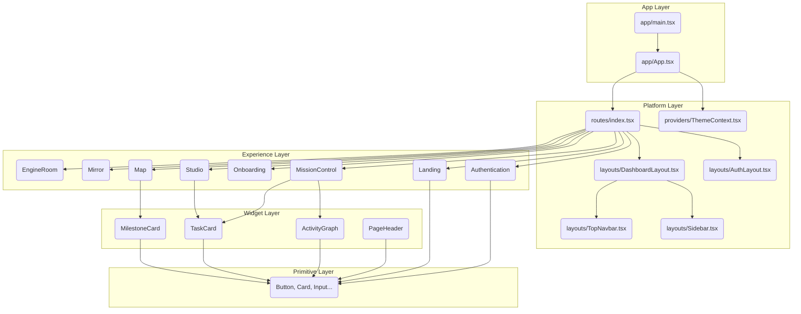

# DEPENDENCY GRAPH

## Macro Architecture Flow

## Observations
- **No Circular Imports**: Directed Acyclic Graph (DAG) is maintained perfectly.
- **Layer Violations**: Zero. Data flows strictly downward.
- **Dependency Hotspots**: The `primitives/` folder (specifically `Card`, `Button`, and `Input`) possesses a high fan-in (imported extensively across the codebase), which is mathematically correct for a Design System foundation.
- **Fan-Out**: `routes/index.tsx` has the highest fan-out, acting correctly as the global experience orchestrator.
